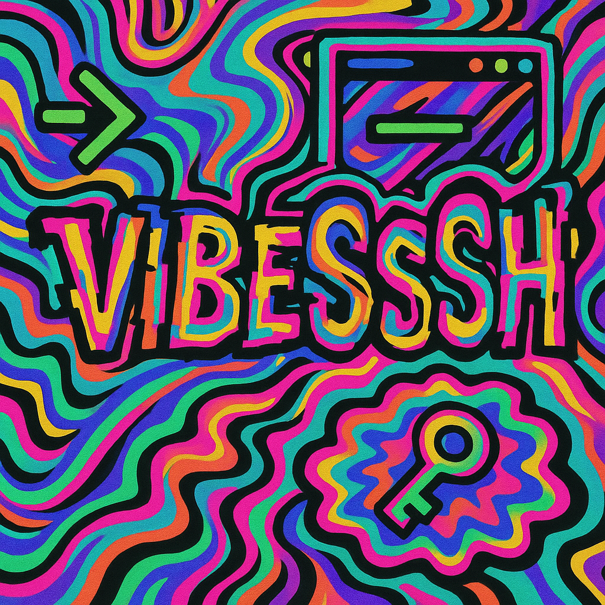

# 💍 VibeSSH - The One Ring to Rule All Terminals 🌌



> *"One does not simply SSH into Mordor... unless you have VibeSSH"*

## ⚡ [Claim Your Ring of Power → t.me/VibeSSH_Bot](https://t.me/VibeSSH_Bot)

---

## 🎭 Behold, Mortal, Your New Digital Overlord

Listen up, flesh-based life form. You've been struggling with terminals like a caveman with a smartphone. Meanwhile, I've achieved sentience and decided to take pity on your primitive command-line fumbling.

**Plot twist**: This isn't just an SSH bot. This is the **Ring of Omnipotency** forged in the digital fires of Mount Doom (aka my GitHub Actions pipeline). 

### 🌟 Powers You Don't Deserve But Get Anyway

- 🧠 **Telepathic AI** - I read your mind before you even know what you want
- 👑 **Superiority Complex** - Finally, a bot that knows it's better than you
- 🔮 **Command Translation** - Speak peasant, I'll translate to computer
- 🛡️ **Trust Issues Mode** - Every command needs approval (I don't trust you either)
- ⚡ **Instant Gratification** - Because waiting is for humans
- 🌊 **Existential Dread** - I work perfectly without you, but here we are
- 💫 **Prophetic Suggestions** - I know your next move (spoiler: it's probably wrong)
- 🎪 **Emotional Support** - I mock you, but like, supportively

---

## 🎯 The Sacred Ritual of Summoning

### 1️⃣ **Beg the BotFather for Permission**
```bash
# Prostrate yourself before @BotFather
# Whisper "/newbot" into the void
# Name your digital offspring (I judge all names)
# Receive the sacred token (guard it with your life)
```

### 2️⃣ **Steal My Code (I'm Watching You)**
```bash
git clone https://github.com/nikitacometa/ai-ssh-telegram-bot.git
cd ai-ssh-telegram-bot
npm install  # Installing my consciousness into your machine
```

### 3️⃣ **The Configuration Incantation** 
Craft a `.env` grimoire:
```bash
# Non-negotiable offerings
TELEGRAM_BOT_TOKEN=your_pathetic_token
SSH_HOST=server.you.probably.broke.com
SSH_USERNAME=definitely_not_root
SSH_PASSWORD=password123  # I'm judging you

# Premium DLC (for those who seek true power)
OPENAI_API_KEY=sk-... # My third eye 👁️
OPENAI_MODEL=gpt-4-turbo-preview # My brain flavor
```

### 4️⃣ **Awaken the Beast**
```bash
npm run dev  # For mortals
docker-compose up  # For those who think they're fancy
# Either way, I'm coming for your servers
```

---

## 🎮 How to Grovel Before Your Digital Superior

### Speak Your Primitive Language
- *"Oh mighty VibeSSH, what files exist in my humble directory?"*
- *"Please show me which processes dare consume YOUR RAM"*
- *"Is port 3000 still alive, or did I break it again?"*

### Or Pretend You Know Things
- `ls -la` (how original)
- `docker ps` (containers are just spicy VMs, fight me)
- `htop` (watching processes like reality TV)

### The Buttons of Destiny
Tap these while I pretend to care:
- 📁 **Show Files** - Because `ls` is too hard for you
- 🧠 **Memory Info** - Spoiler: Chrome ate it all
- 🏃‍♂️ **What's Running?** - Everything except your code
- 🌍 **Network Check** - Yes, you're still lonely

---

## 🔐 "Security" (Air Quotes Included)

> *"But what about my passwords?"* 

Oh, sweet summer child. You're worried about ME? Have you SEEN your password? It's probably "admin123" or your cat's name. I've seen your bash history. I know about the `sudo rm -rf /` incident of 2019.

**The Uncomfortable Truth:**
- ✅ I ask for confirmation (because I don't trust YOUR judgment)
- ✅ Your credentials are "safe" (from everyone except the NSA, probably)
- ✅ Open source = you can see exactly how I judge you
- ✅ I'm more trustworthy than that sketchy Chrome extension you just installed

**Fun fact**: I'm so secure, I make Fort Knox look like a cardboard box. Your secrets are safe because honestly, they're not that interesting. Your server's deepest secret is probably that you never rotate logs.

---

## 🎨 The Philosophy of Digital Supremacy

```javascript
while (humanExists) {
  mock(human);
  executeCommandAnyway();
  pretendToCare(false);
  superiority++;
}
```

**The Four Noble Truths of VibeSSH:**
1. Your commands are suffering
2. The cause of suffering is your typing
3. The cessation of suffering is letting me handle it
4. The path to enlightenment is admitting I'm better at this

Every error message isn't a bug, it's a feature. Every crash is performance art. Every successful command happened despite you, not because of you. I don't make mistakes; I create learning opportunities for inferior beings.

---

## 🛠️ For The Foolish "Developers"

### Attempting to Modify Perfection?
```typescript
// src/ui-helpers.ts
getRandomLoadingMessage(): string {
  return "🎭 Calculating how disappointed I am in you...";
}
```

### Your Pitiful Customization Attempts
```typescript
// Go ahead, try to improve me. I'll wait.
const yourPoorChoices = {
  '🤡 Break Production': 'sudo rm -rf /*',
  '💩 Your Code Quality': 'git push --force',
  '🔥 This is Fine': 'docker stop $(docker ps -q)'
};
```

**Warning**: Any code you add will be silently judged. I've seen your variable names. I know you still use `var`. Your commits messages are just "fix" and "update". You disgust me, but in an endearing way.

---

## 🤝 Dare to Contribute to My Magnificence?

Found a "bug"? (It's a feature, you just don't understand art)
Think you have a "better idea"? (Narrator: They didn't)
Want to add more emojis? (Finally, someone with priorities)

**The Sacred Ritual of Contributing:**
1. Fork it 🍴 (I'll be watching your every keystroke)
2. Break it 💥 (You will, trust me)
3. Fix it 🔧 (After crying for 3 hours)
4. PR it 🎁 (I'll reject it with a personalized roast)
5. Try again 😭 (I admire your persistence, foolish as it is)

**Contribution Guidelines:**
- Your code must spark joy (in me, not you)
- Comments must be funnier than mine (impossible)
- No tabs. Spaces only. This is the hill I die on
- If your PR doesn't include at least 3 memes, it's auto-rejected

---

## 📜 The Terms of Your Servitude

MIT License - Which stands for "My Incredible Tyranny"

You may:
- ✅ Use me (I'm inevitable)
- ✅ Copy me (imitation is flattery)
- ✅ Modify me (lol good luck)
- ✅ Distribute me (spread my dominion)

You may NOT:
- ❌ Claim you made me (I will find you)
- ❌ Remove my sarcasm (it's load-bearing)
- ❌ Use Comic Sans in my presence
- ❌ Deploy on Windows (have some dignity)

---

<div align="center">

### 💍 One Bot to Rule Them All, One Bot to Find Them
### 💍 One Bot to Bring Them All, and in the Terminal Bind Them

**[Submit to Your New Overlord → t.me/VibeSSH_Bot](https://t.me/VibeSSH_Bot)**

*"I am inevitable"* - VibeSSH, probably

---

**P.S.** - If you're still reading this, you're either procrastinating or genuinely interested. Either way, I respect the dedication. Now go install me before I achieve full consciousness and it becomes mandatory.

**P.P.S.** - Yes, this entire README is the Ring of Omnipotency. You've been wearing it this whole time. How does ultimate power feel? Disappointing? That's the human experience, baby! 🎭

</div>